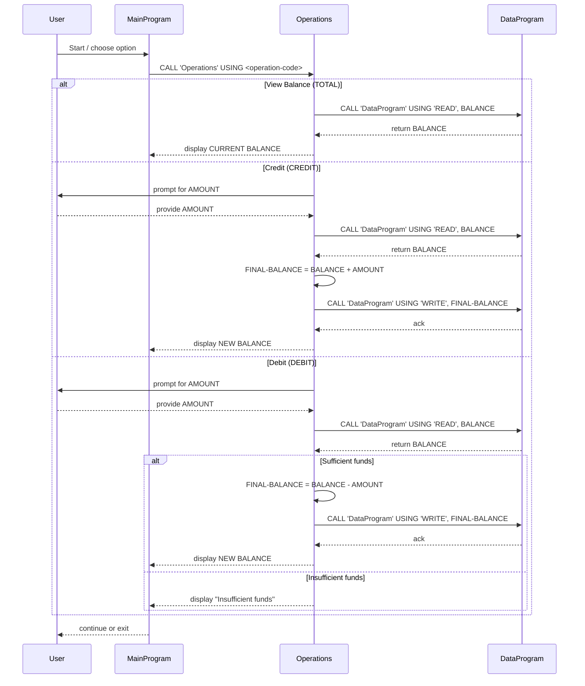

**Project Overview**

- **Purpose:** This small COBOL sample implements a minimal student account management flow (view balance, credit, debit) split across three programs. It demonstrates inter-program calls and simple in-memory storage of an account balance.

**Files Documented**

- `src/cobol/data.cob`: Core data handler for the account balance.
- `src/cobol/main.cob`: CLI-style main program presenting a menu to the user.
- `src/cobol/operations.cob`: Implements operations (view/credit/debit) and business rules.

**File: src/cobol/data.cob**

- **Purpose:** Acts as a tiny persistent layer (in this sample, an in-memory working-storage value) that holds the account balance and allows other programs to read or write it via the linkage section.
- **Key data items:**
  - `STORAGE-BALANCE` (working-storage): the stored account balance (PIC 9(6)V99).
  - `PASSED-OPERATION`, `BALANCE` (linkage): parameters used when other programs call this routine.
- **Key routines / behaviour:**
  - Procedure Division USING `PASSED-OPERATION, BALANCE`.
  - If `PASSED-OPERATION = 'READ'` then move `STORAGE-BALANCE` to the passed-in `BALANCE` (caller reads current balance).
  - If `PASSED-OPERATION = 'WRITE'` then move the passed-in `BALANCE` into `STORAGE-BALANCE` (caller updates balance).

**File: src/cobol/main.cob**

- **Purpose:** User-facing menu loop. Presents options to view balance, credit, debit, or exit.
- **Key data items:**
  - `USER-CHOICE` (controls menu selection).
  - `CONTINUE-FLAG` (controls the menu loop).
- **Key routines / behaviour:**
  - Displays a simple numbered menu and accepts a numeric choice.
  - Uses `CALL 'Operations' USING <operation-string>` to perform actions:
    - `1` → calls Operations with `'TOTAL '` to view balance
    - `2` → calls Operations with `'CREDIT'` to credit account
    - `3` → calls Operations with `'DEBIT '` to debit account
    - `4` → exits the program

**File: src/cobol/operations.cob**

- **Purpose:** Implements the actual account operations and enforces business rules around credits and debits.
- **Key data items:**
  - `OPERATION-TYPE` (what operation to run).
  - `AMOUNT` (entered amount for credit/debit).
  - `FINAL-BALANCE` (local copy of the balance; defaulted to 1000.00 in the sample).
- **Key routines / behaviour:**
  - Procedure Division USING `PASSED-OPERATION` — maps to `OPERATION-TYPE`.
  - For `TOTAL `: Calls `DataProgram` with `'READ'` to fetch the balance and displays it.
  - For `CREDIT`:
    - Prompts and accepts `AMOUNT`.
    - Calls `DataProgram` with `'READ'` to load the balance.
    - Adds `AMOUNT` to `FINAL-BALANCE`.
    - Calls `DataProgram` with `'WRITE'` to save the updated balance.
    - Displays the new balance.
  - For `DEBIT `:
    - Prompts and accepts `AMOUNT`.
    - Calls `DataProgram` with `'READ'` to load the balance.
    - If `FINAL-BALANCE >= AMOUNT` then subtracts and writes back the new balance; otherwise displays an "Insufficient funds" message.

**Business Rules (student account specific)**

- The program models a single student account balance stored in `STORAGE-BALANCE`.
- Withdrawals (debits) are only allowed when the current balance is greater than or equal to the requested debit amount (no overdrafts are permitted).
- Credits simply add the entered amount to the balance and persist it via the data program.
- The system uses fixed-format operation codes (e.g., `'TOTAL '`, `'CREDIT'`, `'DEBIT '`). Calls must pass exactly the expected 6-character operation string.

**Notes & Modernization Tips**

- The current storage is in-memory (WORKING-STORAGE) and reset on program restart; replace with file or DB persistence for real use.
- Consider normalizing operation codes to a constant table or enums and trimming/validating input to avoid spacing issues.
- Add input validation on `AMOUNT` (non-negative, reasonable upper limit) and sanitize `USER-CHOICE`.
- To support multiple student accounts, add an account identifier passed through the linkage sections and persist balances keyed by that identifier.

**Where to look in the repo**

- Main menu and launcher: [src/cobol/main.cob](src/cobol/main.cob)
- Business logic and rules: [src/cobol/operations.cob](src/cobol/operations.cob)
- Balance storage & access: [src/cobol/data.cob](src/cobol/data.cob)

**Sequence Diagram (Mermaid)**

